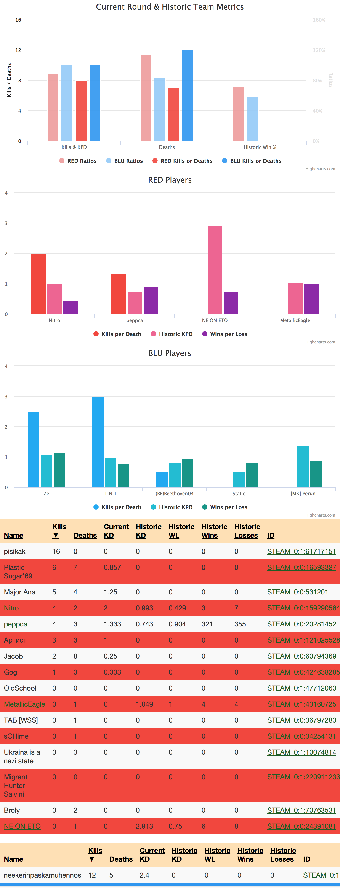

# gameme-stacker-tracker
Web UI to get real-time statistics on gameME-tracked TF2 servers to predict wins and determine fairness of teams.
# Usage
The URL has is the target server to try to pull stats about. In `main.js` there is a defined `window.apiBase`, and something like [cors-anywhere](cors-anywhere) is required for this to work (as the gameME API doesn't add CORS headers).
[gameME API doc](https://www.gameme.com/docs/api)
# Example:

# Live Demo
[http://ip2k.com](http://ip2k.com)
# License
MIT
